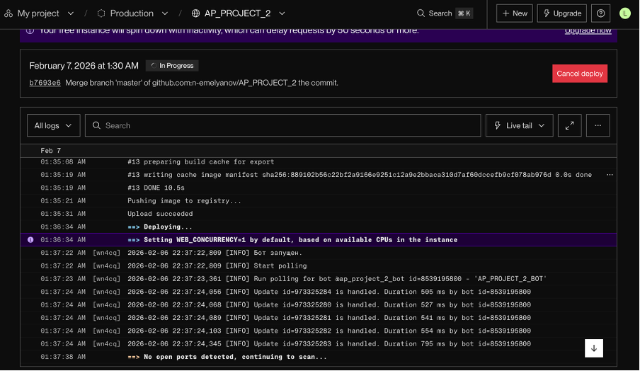
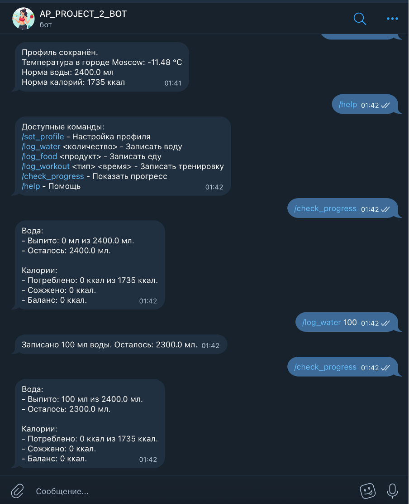

# Telegram Bot

Бот для расчёта нормы воды, калорий и трекинга активности.

## Структура проекта
```bash
.
├── models/                 # Модуль для хранения данных и состояний
│   ├── config.py           # Конфигурация приложения (токены, настройки)
│   ├── models.py           # Модели данных (хранилище users)
│   └── states.py           # Состояния FSM для диалогов (Profile)
│ 
├── notebooks/              # Jupyter ноутбуки для тестирования и анализа
├── screens/      
├── utils/                  # Утилиты и вспомогательные функции
│   ├── api.py              # API клиенты (OpenWeatherMap, OpenFoodFacts)
│   ├── food.py             # Расчетные функции
│   └── handlers.py         # Обработчики команд Telegram бота
│ 
├── bot.py                  # Главный файл запуска бота
├── Dockerfile 
├── LICENSE               
├── poetry.lock    
└── pyproject.toml       
```

## Локальный запуск

### 1. Установка `Poetry`

* Для macOS/Linux:
```bash
curl -sSL https://install.python-poetry.org | python3 -
echo 'export PATH="$HOME/.local/bin:$PATH"' >> ~/.zshrc
source ~/.zshrc
```

* Для Windows (PowerShell):
```bash
(Invoke-WebRequest -Uri https://install.python-poetry.org -UseBasicParsing).Content | python -
[System.Environment]::SetEnvironmentVariable("Path", $env:Path + ";$env:APPDATA\Python\Scripts", [System.EnvironmentVariableTarget]::User)
```

### 2. Клонируйте репозиторий:

```bash
git clone https://github.com/n-emelyanov/AP_PROJECT_2.git
cd AP_PROJECT_2
```

### 3. Активируйте виртуальное окружение

```bash
poetry install
```
```bash
source $(poetry env info --path)/bin/activate
```

### 4. Создайте файл .env с токенами:

```bash
BOT_TOKEN=<ваш_токен_бота>
OPEN_WEATHER_TOKEN=<ваш_токен_OpenWeather>
```

### 5. Запустите бота:

```bash
python bot.py
```

## Онлайн деплой

Бот загружен на [Render.com](https://dashboard.render.com/) и должен работать онлайн. Бот в Телеграм - `@ap_project_2_bot`

**Скрины запуска:**



**Скрины работы бота:**
